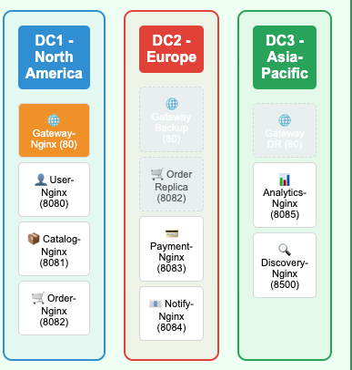

# Service Architecture

This document explains the internal architecture of the microservices running across 3 datacenters.

All services are containerized using Nginx and simulate core components of a distributed e-commerce platform.

---

## Service Breakdown

| Service           | Description                      | Port | DC(s)      |
|------------------|----------------------------------|------|------------|
| gateway-nginx    | Load balancer & entry point      | 80   | DC1, DC2, DC3 |
| user-nginx       | User management API              | 8080 | DC1        |
| catalog-nginx    | Product catalog service          | 8081 | DC1        |
| order-nginx      | Order service (replicated)       | 8082 | DC1, DC2   |
| payment-nginx    | Payment processing               | 8083 | DC2        |
| notify-nginx     | Notification simulation          | 8084 | DC2        |
| analytics-nginx  | Reporting/analytics              | 8085 | DC3        |
| discovery-nginx  | Service registry endpoint        | 8500 | DC3        |

---

## Service Architecture Diagram 
